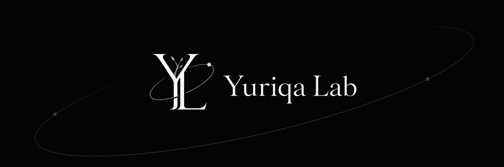

  

  

<h1 align="center">Yuriqa Lab</h1>

  Research notes, tools, and experiments.

## Projects

### Travel Atlas

A local-first interactive world and Japan travel map.

- [Repository](https://github.com/yuriqa-lab/travel-atlas)
- [Live Site](https://yuriqa-lab.github.io/travel-atlas/)

### Model Drift Observation Kit

A small interactive tool for observing changes in model behavior.

- [Repository](https://github.com/yuriqa-lab/model-drift-observation-kit)
- [Live Site](https://yuriqa-lab.github.io/model-drift-observation-kit/)

## About Yuriqa Lab

Yuriqa Lab is a personal space for building, observing, documenting, and learning through small public projects.
